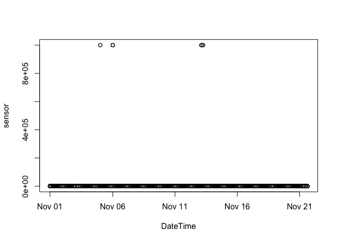
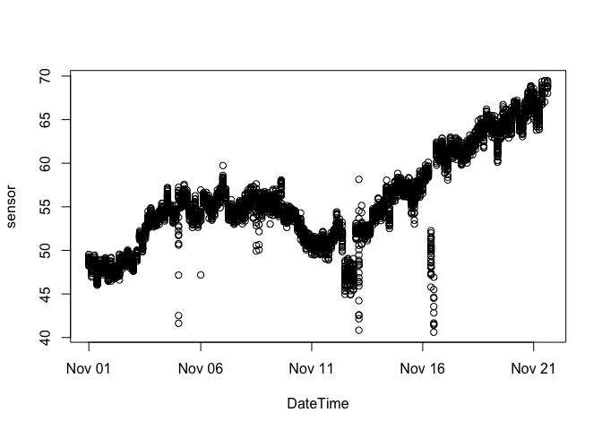

Installation
------------

To install the stable version of `sensorQC` package with dependencies:

``` r
install.packages("sensorQC", 
    repos = c("http://owi.usgs.gov/R","http://cran.rstudio.com/"),
    dependencies = TRUE)
```

Or to install the current development version of the package (using the `devtools` package):

``` r
devtools::install_github("USGS-R/sensorQC")
```

This package is still very much in development, so the API may change at any time.

| Name           | Status                                                                                                                                                             |
|:---------------|:-------------------------------------------------------------------------------------------------------------------------------------------------------------------|
| Linux Build:   | [](https://travis-ci.org/USGS-R/sensorQC)                                                  |
| Windows Build: | [](https://ci.appveyor.com/project/jread-usgs/sensorqc)                               |
| Package Tests: | [](https://coveralls.io/github/USGS-R/sensorQC?branch=master) |

High-frequency aquatic sensor QAQC procedures. `sensorQC` imports data, and runs various statistical outlier detection techniques as specified by the user.

### `sensorQC` Functions (as of v0.3.1)

| Function | Title                                                  |
|----------|:-------------------------------------------------------|
| `read`   | read in a file for sensor data or a config (.yml) file |
| `window` | window sensor data for processing in chunks            |
| `flag`   | create data flags for a sensor                         |

### example usage

``` r
library(sensorQC)
```

    ## This information is preliminary or provisional and is subject to revision. It is being provided to meet the need for timely best science. The information has not received final approval by the U.S. Geological Survey (USGS) and is provided on the condition that neither the USGS nor the U.S. Government shall be held liable for any damages resulting from the authorized or unauthorized use of the information. Although this software program has been used by the USGS, no warranty, expressed or implied, is made by the USGS or the U.S. Government as to the accuracy and functioning of the program and related program material nor shall the fact of distribution constitute any such warranty, and no responsibility is assumed by the USGS in connection therewith.

``` r
file <- system.file('extdata', 'test_data.txt', package = 'sensorQC') 
sensor <- read(file, format="wide_burst", date.format="%m/%d/%Y %H:%M")
```

    ## number of observations:5100

``` r
flag(sensor, 'x == 999999', 'persist(x) > 3', 'is.na(x)')
```

    ## object of class "sensor"
    ##                  times     x
    ## 1  2013-11-01 00:00:00 48.86
    ## 2  2013-11-01 00:00:01 49.04
    ## 3  2013-11-01 00:00:02 49.50
    ## 4  2013-11-01 00:00:03 48.91
    ## 5  2013-11-01 00:00:04 48.90
    ## 6  2013-11-01 00:00:05 48.96
    ## 7  2013-11-01 00:00:06 48.48
    ## 8  2013-11-01 00:00:07 48.97
    ## 9  2013-11-01 00:00:08 48.97
    ## 10 2013-11-01 00:00:09 48.99
    ## 11 2013-11-01 00:00:10 48.35
    ## 12 2013-11-01 00:00:11 48.51
    ## 13 2013-11-01 00:00:12 49.25
    ## 14 2013-11-01 00:00:13 48.82
    ## 15 2013-11-01 00:00:14 49.22
    ##   ...
    ## x == 999999 (15 flags)
    ## persist(x) > 3 (4 flags)
    ## is.na(x) (0 flags)

Use the `MAD` (median absolute deviation) test, and add `w` to the function call to specify "windows" (note, sensor must be windowed w/ `window()` prior to using `w`)

``` r
sensor = window(sensor, type='auto')
flag(sensor, 'x == 999999', 'persist(x) > 3', 'MAD(x,w) > 3', 'MAD(x) > 3')
```

    ## object of class "sensor"
    ##                  times     x
    ## 1  2013-11-01 00:00:00 48.86
    ## 2  2013-11-01 00:00:01 49.04
    ## 3  2013-11-01 00:00:02 49.50
    ## 4  2013-11-01 00:00:03 48.91
    ## 5  2013-11-01 00:00:04 48.90
    ## 6  2013-11-01 00:00:05 48.96
    ## 7  2013-11-01 00:00:06 48.48
    ## 8  2013-11-01 00:00:07 48.97
    ## 9  2013-11-01 00:00:08 48.97
    ## 10 2013-11-01 00:00:09 48.99
    ## 11 2013-11-01 00:00:10 48.35
    ## 12 2013-11-01 00:00:11 48.51
    ## 13 2013-11-01 00:00:12 49.25
    ## 14 2013-11-01 00:00:13 48.82
    ## 15 2013-11-01 00:00:14 49.22
    ##   ...
    ## x == 999999 (15 flags)
    ## persist(x) > 3 (4 flags)
    ## MAD(x,w) > 3 (129 flags)
    ## MAD(x) > 3 (91 flags)

Use sensorQC with a simple vector of numbers:

``` r
flag(c(3,2,4,3,3,4,2,4),'MAD(x) > 3')
```

    ## object of class "sensor"
    ##   x
    ## 1 3
    ## 2 2
    ## 3 4
    ## 4 3
    ## 5 3
    ## 6 4
    ## 7 2
    ## 8 4
    ## 
    ## MAD(x) > 3 (0 flags)

plot dataset w/ outliers:

``` r
plot(sensor)
```



plot dataset w/o outliers:

``` r
flagged = flag(sensor, 'x == 999999', 'persist(x) > 3', 'MAD(x,w) > 3', 'MAD(x) > 3')
plot(flagged)
```


